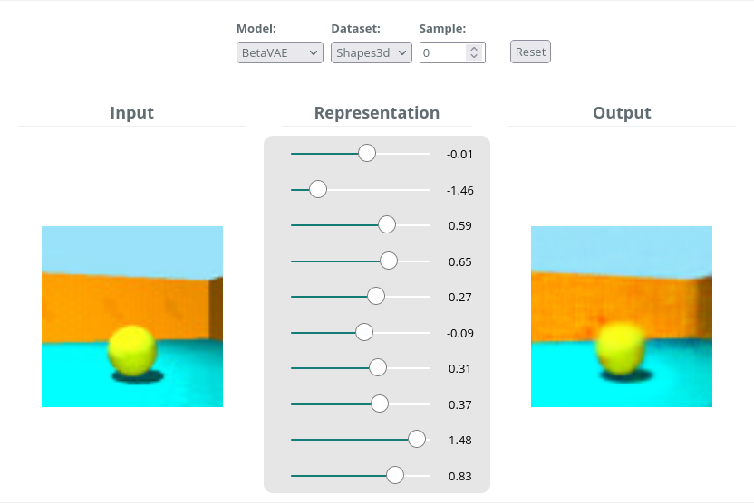
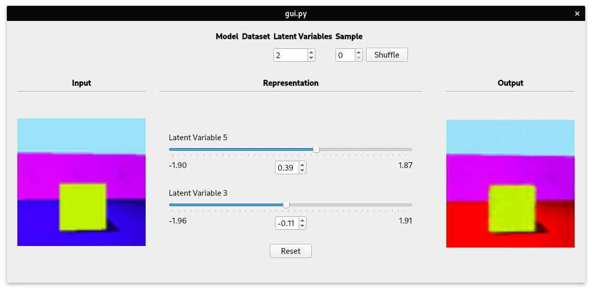
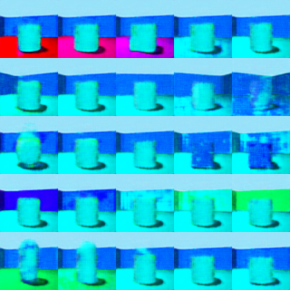

# Disentangled Representations 
Full code for implementations and evaluations described in my thesis [Introducing Sparsity into the Current Landscape of Disentangled Representation Learning](http://urn.kb.se/resolve?urn=urn:nbn:se:kth:diva-292929).

Web demo and summary can be accessed [here](https://eageby.github.io/disentangled-representations/).
## Thesis
Investigating the current landscape of disentangled representation learning in an image based setting.
Implementation and benchmarking of current models:
- [&#946;-VAE](https://openreview.net/forum?id=Sy2fzU9gl)
- [&#946;-TCVAE](https://arxiv.org/abs/1802.05983)
- [FactorVAE](https://arxiv.org/abs/1802.05983)

As well as proposing a sparsity inducing model which maintains disentanglement:
- &#946;-SVAE 

We consider the following datasets
- [Shapes3d](https://github.com/deepmind/3dshapes-dataset/)
- [DSprites](https://github.com/deepmind/dsprites-dataset/)
- [CelebA](https://arxiv.org/abs/1411.7766)

## Quantitative Evaluation
The benchmarking of models includes a comparison of the quantitative metrics:
- [Mutual Information Gap](https://arxiv.org/abs/1411.7766)
- [Discrete Mutual Information Gap](https://arxiv.org/abs/1811.12359)
- [Gini Index](https://ieeexplore.ieee.org/document/5934357)

## Qualitative Evaluation
### Web-demo
[Web demo preview.](docs/assets/img/DemoPreview.jpg)
%% <p align="center">
	%% <a href="https://eageby.github.io/disentangled-representations/#demo">
		%%  
	%% </a>
%% </p>

### Graphical User Interface (GUI)
<p align="center">
	 
</p>

### Latent Traversals
<p align="center">
	 
</p>

# Command Line Interface (CLI)
## Main interface
```console
Usage: disentangled [OPTIONS] COMMAND [ARGS]...

  Train and evaluate disentangled representation learning models.

Options:
  -c, --config TEXT               Add gin-configuration.
  -p, --gin-param, --gin-parameter TEXT
                                  Add gin-config parameter.
  -f, --gin-file TEXT             Specify gin-config file.
  -h, --help                      Show this message and exit.

Commands:
  dataset     Interface for viewing and preparing datasets.
  evaluate    Interface for evaluating models.
  experiment  Interface for running full scale experiment.
  train       Interface for training models by using syntax MODEL/DATASET.
  ```
